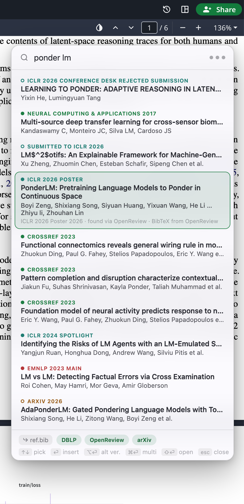
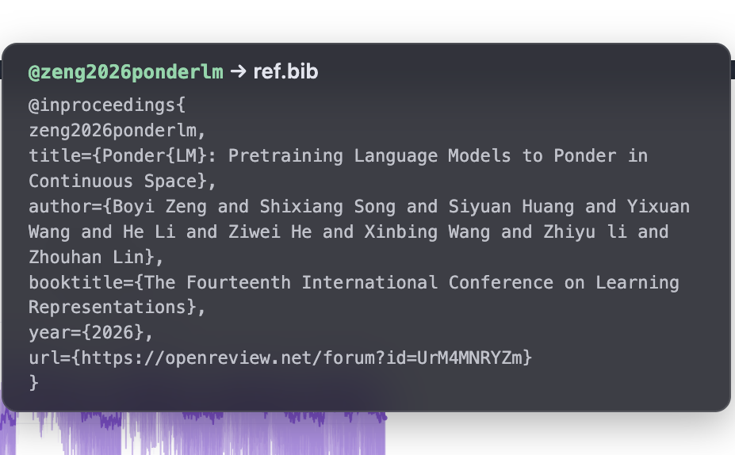

# EasyCite

Fast citation insertion for Overleaf. Press **Ctrl/Cmd+Shift+E**, type a few words of a paper you already know (title, authors, year), hit Enter — the BibTeX entry lands in your `.bib` file (invisibly, no tab switching) and the citation key is inserted at the cursor, merged into an existing `\cite`/`\citep`/`\citet` if you're inside one.

Searches DBLP, OpenReview, and arXiv in parallel; prefers official published versions (ACL Anthology, NeurIPS/ICML/ICLR via OpenReview/DBLP, CVPR, COLM, TMLR, …) over arXiv preprints, with `⌥⏎` to grab the preprint instead.

Designed for computer science — AI/ML and NLP in particular, which is what the source databases cover best — but extendable: sources are small self-contained modules (`src/core/sources/`, a URL builder plus a response parser each), so other venues and journals can be added by writing one.

<p align="center">
  
</p>
<p align="center">
  
</p>

## Install

Download `easycite-vX.Y.Z.zip` from the [latest release](../../releases/latest) and unzip it — you get an `easycite/` folder. Move it somewhere permanent (Chrome loads the extension from that folder), then load it as an unpacked extension at `chrome://extensions` (enable Developer mode → "Load unpacked"). To update, unzip the newer release, replace the `easycite/` folder in place, and click the reload arrow on `chrome://extensions` — the path stays the same, so no reinstall.

Or build from source:

```sh
npm install
npm run build
```

and load `dist/` the same way.

## Usage

- `Ctrl/Cmd+Shift+E` — open the search overlay (rebind at `chrome://extensions/shortcuts`)
- `↑↓` pick · `⏎` insert · `⌥⏎` insert the alternate (preprint/official) version · `⌘⏎` insert and keep the overlay open for multi-key cites · `⇧⏎` open the paper in a new tab · `esc` close
- Footer: per-project bibliography file picker and source toggles (saved per Overleaf project)
- Global defaults (citation key format, alphabetical vs append, default cite command) in the popup behind the toolbar icon

## Permissions and privacy

EasyCite collects no personal information and phones home to nothing — there is no analytics, no telemetry, and no server of its own. The permissions it asks for:

- **`storage`** — saves your settings (citation key format, per-project `.bib` file and source toggles) via `chrome.storage.sync`. That data lives in your browser profile; if you have Chrome sync enabled, Chrome syncs it across your devices like any other extension setting.
- **`overleaf.com`** — runs the overlay on project pages and talks to Overleaf's own APIs (file list, the editing websocket) with your existing session to write into your project's `.bib` file. It only ever touches the project you have open.
- **`dblp.org`, `api2.openreview.net`, `arxiv.org` / `export.arxiv.org`, `aclanthology.org`** — your search queries are sent to these public paper databases, and BibTeX entries are fetched from them. The query text (what you type, or the text under your cursor used to seed a search) is the only document content that ever leaves Overleaf, and it goes only to whichever of these sources you have enabled.

## Develop

```sh
npm run dev    # vite + CRXJS hot reload
npm test       # vitest unit tests for the core logic
```

## Release

A monthly workflow cuts a patch release automatically when main has new commits since the last tag (Dependabot bumps are tested and auto-merged when they pass, except majors). For a manual minor/major release, bump `version` in `manifest.config.ts` and `package.json`, then:

```sh
git tag v0.3.0 && git push --tags
```

GitHub Actions builds, tests, zips `dist/`, and publishes the release automatically.
